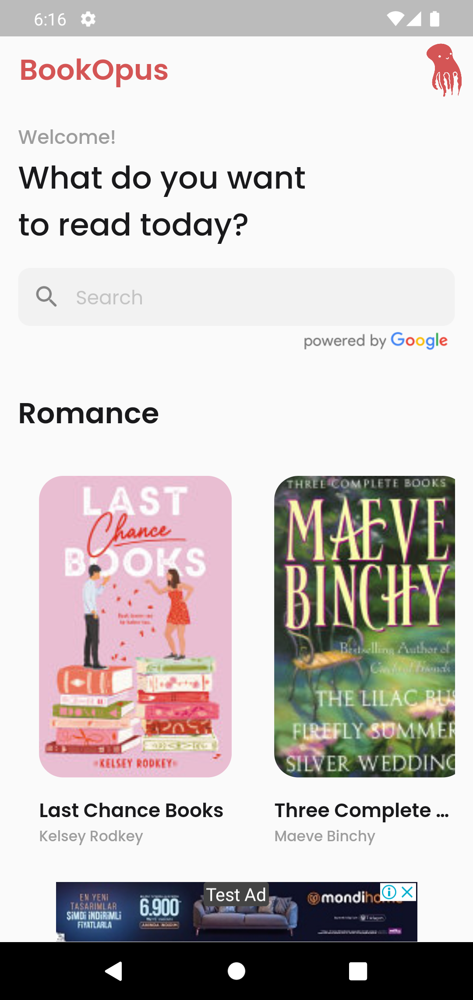
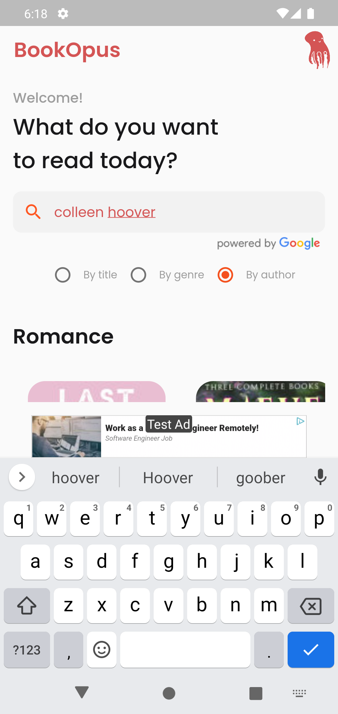
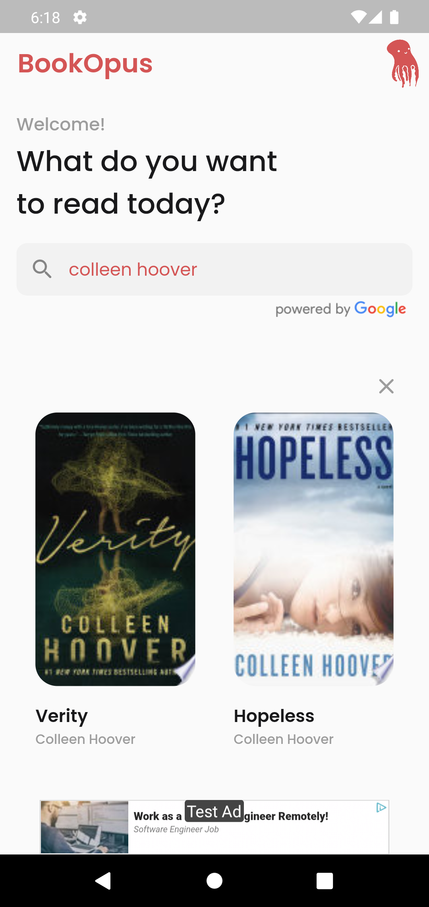
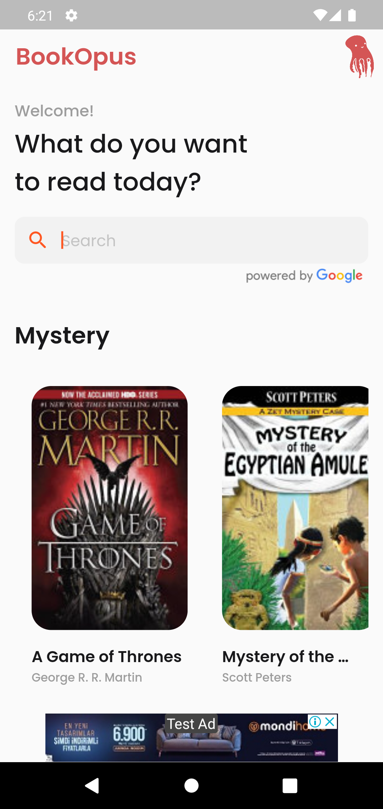
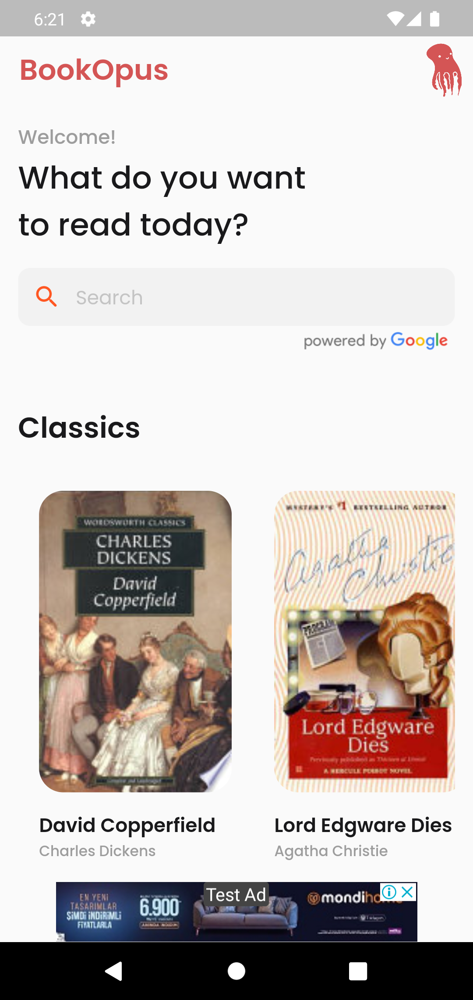

# BookOpus

A Book Finder app that fetches data from Google Books API. Also gives details about any book along with a link to purchase it.

## Features

- Books and E-books aggregator app that fetches books from Google Books API
- Home screen displays books by genre and books can be searched by the title, author's name, and genre.
- Clicking on the book title shows details of the book along with a link to purchase it
- Banner ad at the bottom of the page
- Used: Flutter, Google Books API, Google Ads

## Screenshots

  

  
